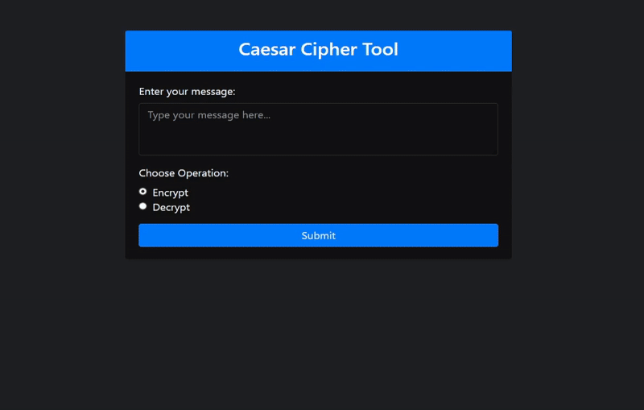

# PRODIGY_CS_01
# Caesar Cipher Tool 🔐

A lightweight web application built with **Python**, **Flask**, and **Bootstrap** that allows you to easily **encrypt** and **decrypt** text using the classic **Caesar cipher**. This tool provides a simple, user-friendly interface where you can input your message and quickly transform it based on a randomly generated key or by specifying the correct decryption key.

---

## 🚀 Features

- **Encrypt** text with a randomly generated Caesar cipher key.
- **Decrypt** text by providing the correct key.
- Simple and intuitive user interface built with **Bootstrap**.
- Real-time encryption and decryption results displayed instantly.
- Responsive design for a smooth experience on both desktop and mobile devices.
- Ideal for learning the basics of cryptography and encryption algorithms.

---

## 🛠️ Tech Stack

- **Frontend:** HTML, CSS (Bootstrap 4/5)
- **Backend:** Python, Flask
- **Encryption Algorithm:** Caesar Cipher (Shift Cipher)

---

## ⚙️ Installation

### Prerequisites

- Python 3.x or higher
- Flask
- Bootstrap (included via CDN)

### Steps to Run Locally

1. Clone the repository:

    ```bash
    git clone https://github.com/your-username/caesar-cipher-tool.git
    ```

2. Navigate to the project directory:

    ```bash
    cd caesar-cipher-tool
    ```

3. Create a virtual environment (optional, but recommended):

    ```bash
    python3 -m venv venv
    ```

4. Install the required Python package:

    ```bash
    pip install flask
    ```

5. Run the Flask application:

    ```bash
    python app.py
    ```

6. Open your browser and go to `http://127.0.0.1:5000/` to use the tool.

---

## 🧑‍💻 Usage

1. **Encrypt**:
    - Enter your plain text message in the "Enter your message" field.
    - Click on "Encrypt". A random key will be generated, and your encrypted message will be displayed instantly.

2. **Decrypt**:
    - Enter the encrypted message in the "Enter your message" field.
    - Provide the key used for encryption.
    - Click on "Decrypt" to reveal the original message.

---

## 📖 How It Works

The **Caesar cipher** works by shifting each letter of the message by a certain number of places in the alphabet. For example, with a shift of 3:

- 'A' becomes 'D'
- 'B' becomes 'E'
- 'C' becomes 'F'
  
For decryption, the process is reversed using the correct key.

---

## 🎨 Demo

Here’s a quick preview of the user interface:



---

## 🤝 Contributing

If you'd like to contribute to this project, feel free to fork the repository, make your changes, and submit a pull request. I welcome all contributions!

---

## 🏷️ Tags

- Python
- Flask
- Caesar Cipher
- Cryptography
- Web App
- Encryption
- Decryption
- Bootstrap

---

## 💬 Questions or Feedback?

Feel free to reach out via GitHub Issues or contact me directly at [md.kashif123490@gmail.com](mailto:your-email@example.com).

